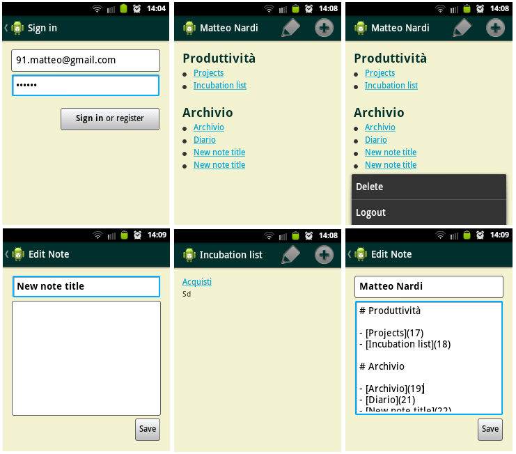

# android-dyanote

During a university project we were instructed to build an Android application.  
I build a client for [Dyanote](https://github.com/MatteoNardi/dyanote), my tomboy-inspired wiki application.

